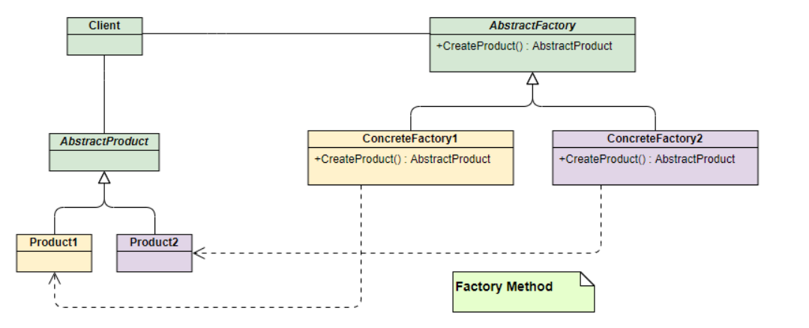
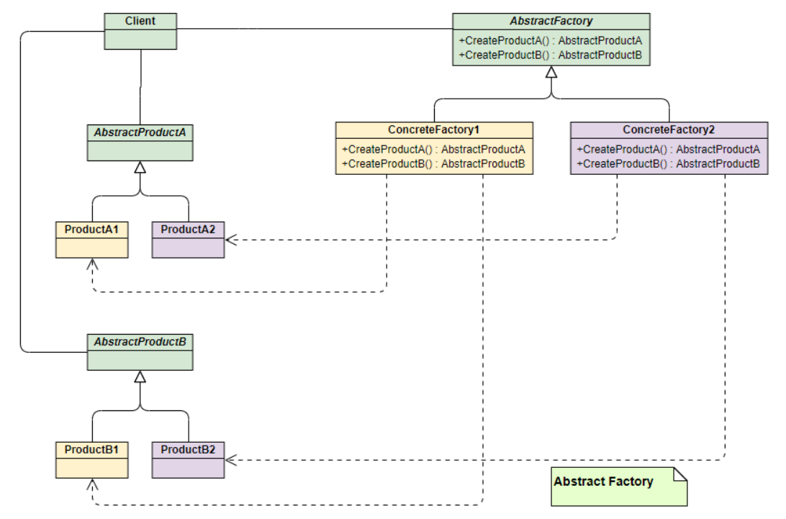
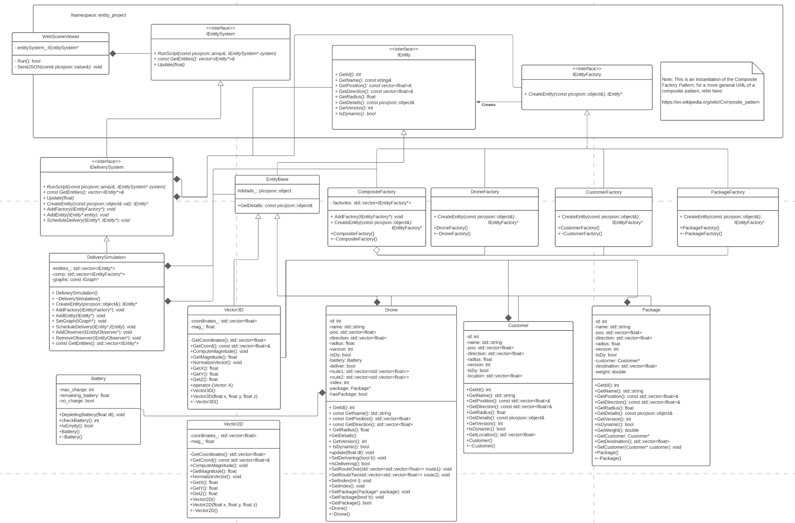
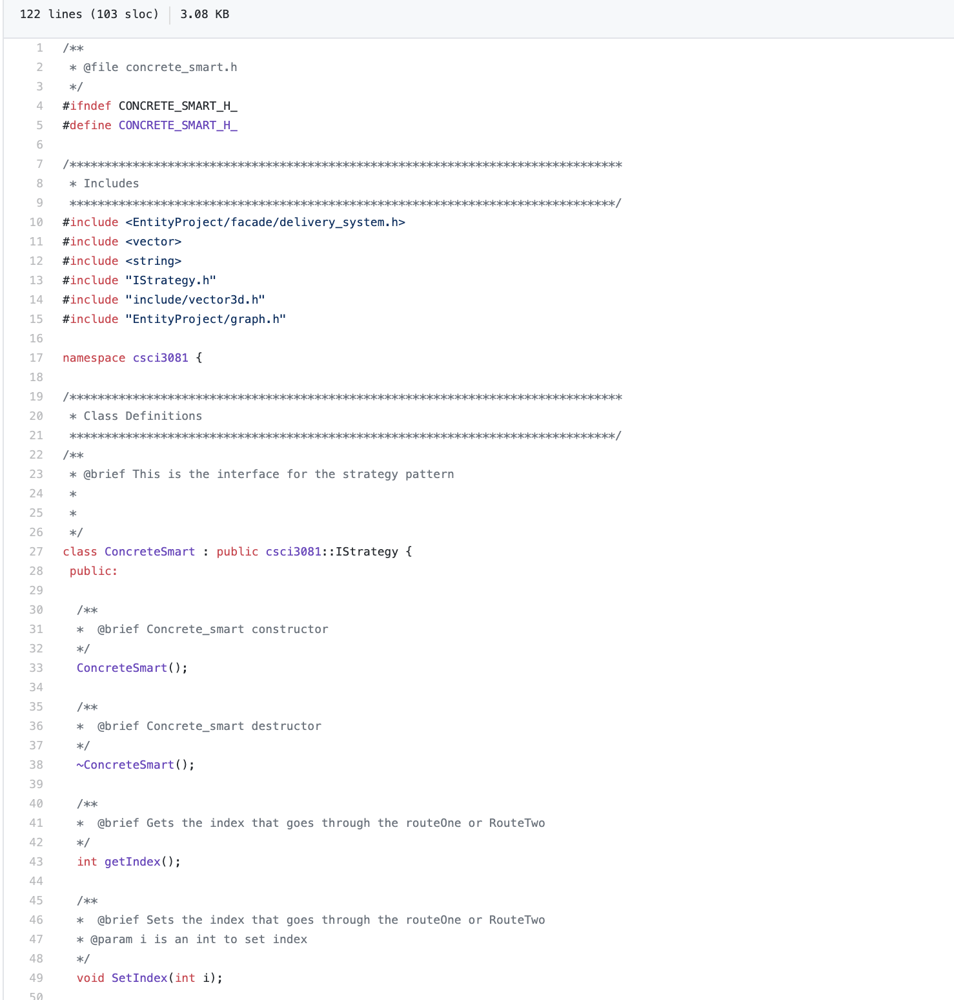
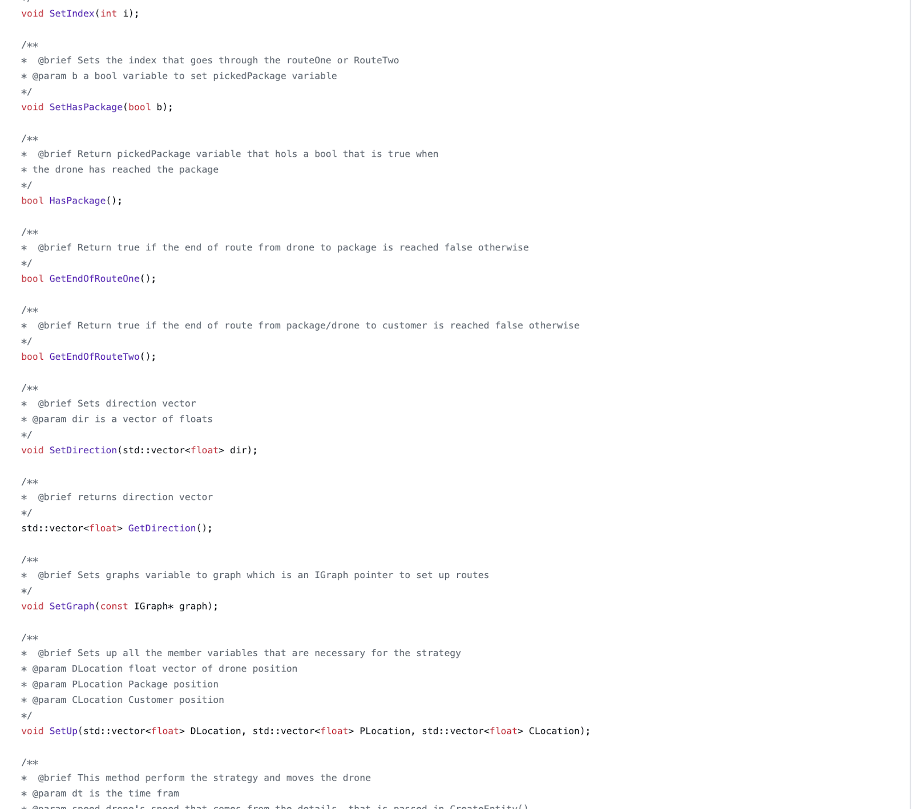
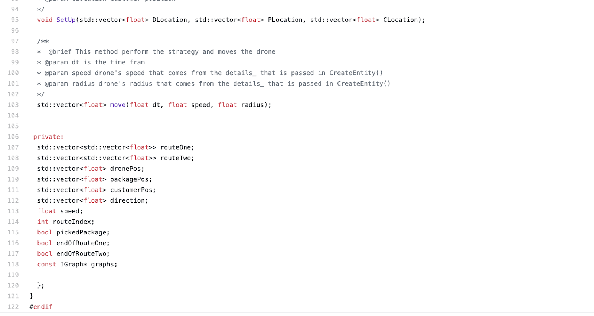
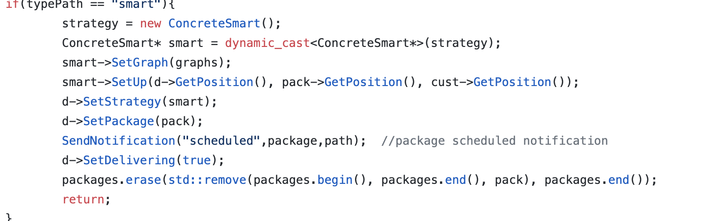
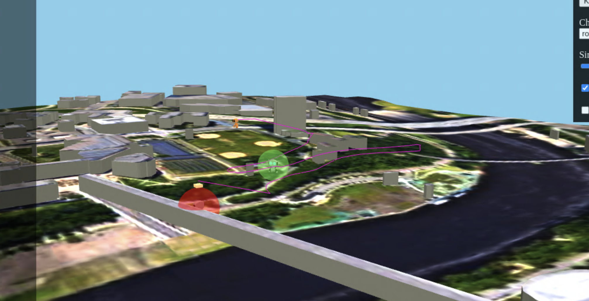
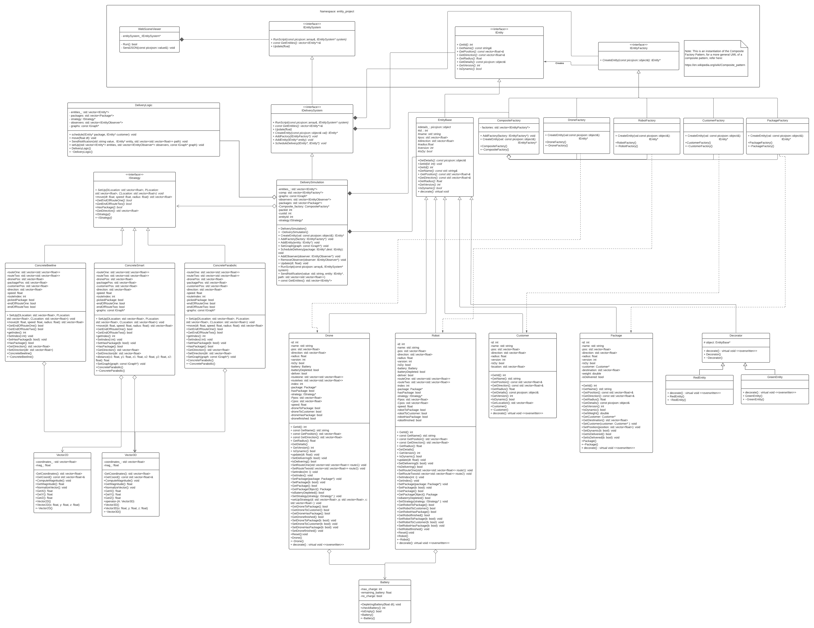

# Drone Delivery System

## Pre-requisites
  * [Git](https://git-scm.com/)

## Docker Pre-requisites
  * Windows 10 Home
    * Install [wsl2 and Ubuntu](https://www.youtube.com/watch?v=ilKQHAFeQR0&list=RDCMUCzLbHrU7U3cUDNQWWAqjceA&start_radio=1&t=7)
  * Install [Docker Desktop](https://hub.docker.com/?overlay=onboarding) from [Docker Hub](https://hub.docker.com/)
  * Linux
    * Use [docker group instead of sudo](https://www.digitalocean.com/community/tutorials/how-to-install-and-use-docker-on-ubuntu-18-04)

## Getting Started with Docker

1. Build docker image

    ```bash
    bin/build-env.sh
    ```

2. Run docker image

    ```bash
    #Usage bin/run-env.sh <port - optional(default 8081)>
    bin/run-env.sh
    ```
    
3. Build project web server (inside docker image) NOTE: You won't be able to `cd` here yet because the project directory does not exist. If you were able to launch the above commands you should now be inside the docker image. You can exit it with CTRL+D now.

    ```bash
    # Inside docker image
    cd /home/user/repo/project
    make
    ```
    
4. Run web server (inside docker image)

    ```bash
    # MUST be within project/ directory inside docker image
    cd /home/user/repo/project
    ./bin/run.sh
    ```
    
5. Open up Firefox and browse to http://127.0.0.1:8081/


## Getting Started using SSH on CSE Lab machines

1. Run the ssh environment
    ```bash
    # Run the ssh environment
    # Example: ./bin/ssh-env.sh <x500> <port> <computer num>
    ./bin/ssh-env.sh myx500 8081 05
    ```

2. Build and run the simulation

    ```bash
    cd /path/to/project
    make -j
    ./bin/run.sh
    ```
  
5. Open up Firefox and browse to http://127.0.0.1:8081/

## Getting Started with VOLE-3D or VOLE

1. Log on to [VOLE-3D or VOLE](https://vole.cse.umn.edu/) (VOLE is slower for graphics, but is great for tests, etc...)

2. Build project

    ```bash
    cd /path/to/cloned/repository
    cd project
    make
    ```
    
 2. Run project

    ```bash
    # MUST be within project/ directory
    ./bin/run.sh
    ```
    
 5. Open up Firefox and browse to http://127.0.0.1:8081/


# CSCI 3081 Delivery Simulation project

## Getting Started

### How to build the project

To build the project, first go to the project/ directory and execute the 'make' command. The project should run with no errors.

### How to run Iteration 3

The project, specifically the final deliverable(iteration 3), works well on all scenes. However, to showcase all of the different scenarios in one scene from the new feature our team implemented, iteration 3 will work best on scene/all_features_no_recharge_station.json, and scene/drone_low_battery_a.json.


### How to Run the project

To run The project it is necesarry to build it first. After the project is built, from the project main direcotry run './bin/run.sh' command.


### How to get documentation

To generate documentation, first build the project with 'make' in the 'project' directory.
Next, navigate to 'project/docs' and run 'doxygen Doxyfile'.
Then open 'project/docs/html/index.html' in your web browser to view the documentation.

## Project Design

A design pattern is a solution or an idea that many programmers can use to solve similar problems. A programmer can not just copy and paste the code but can impliment the structure that has been proven to work. Its a blueprint that can be implemented. Before explaining about the design used for the project ill go over some of the most used design patters.

the advantages of uisng design patters comes to:

* Consistent format.
* Lot of documentation.
* Comunication; A team would know what is expected when a pattern is chosen.

### Factory pattern design

The factory patterns design allows programmers to have an interface that will be seen by the client but all the objetcs creation is done through factories, allowing the program to be dynamically extensible at runtime. This pattern specifies the object to be created by passing the type to the factory.

The factory model distributes the task of creating objects to a specific factories. for example, instead of having a factory that creates car and motorbike objects you create factories that the only purpose is to create those objects, this allows to add new factories without the need to modify the existing code.

Here is a UML example of how the factory pattern works:



The advantages of using factory pattern is that it can create different objects by overriding the parent class implementation and when an object needs a certain type of functionality, the factories can directly instatiate the object that can offer those functionalities. Another advantage is that it is really useful for creating diferrent objetc at the same time, for example, an airplane object and a pilot object making sure each airplane would have a pilot.

The disadvantages of using the factory pattern comes to the high coupling between classes, also if there is a change in the high calsses in the hierarchy then all the ohter classes needs to change.

### Abstract factory pattern

If we compare the abstract factory pattern with the factory pattern we can tell that the factory pattern is better used for when there is the need of creating one "kind" of objects, for example, let's say T.V. So you would have factories creting different types of T.V. now, lets say you want to add another "kind" of product like the creation of laptop objects into the code. If we implement this using the factory pattern a lot of the code should cnhage but also would get really messy which it defies the purpose of having a pattern.

The abstract factory pattern allows programmers to implement problems like the one previously described. In the abstract pattern we would have an interface to create a product in AbstarctFactory, and then implement the creation of new products in specific sub factories, provided that the sub factories support the production of the product. Otherwise, the inherited interface can do nothing.

Here is a UML example of how the abstract factory pattern works:



As an advantage of using the abstract pattern is avoiding the tight coupling between the client code and the products, also it allows to follow the open/closed principle because it allows programmers to add new products into the code withouth the need to modify the existing one.

As a disadvantage, the abtarstract factory gat get very complicated that it should be because of new interfaces.

### Composite factory pattern

While the factory and abstract factory patterns belongs to what its called the creational patters , the composite factory belongs to the structural patterns category.

The composite factory is used when a group of objects is treated the same way as a single instance of the same type of object. In other words, its a tree structure of objects where every object has the same interface.

In this pattern the interface describes operations that are common to objects an dusually these objects are the one doing most of the work and the client can work with any object in the pattern.

The composite factory is the chosen pattern for the delivery drone project. the reason is that we have three objects with similar functionalities therefore they can share a common interface so the client dont have to know how the creation and work of objects is done. In this project these objects are drones, packages and customers.

this pattern makes it easy to add new elements to the projecj like, !Spoiler Alert! robots, or trucks that provides another way to deliver packages. This pattern also borrows from the factory pattern therefor we also have a factory interface and individual factories in charge of the creation of the objects.

The disadvantage of the composite factory pattern is that it might be hard to provide a common interface for objects or classes whose funtionalities that differ too much from the one already implemented.

Here is a UML representation of the delivery drone project which shows the composite factory pattern:



### Designing and Implementing New Routes
In our project, we have drones fly in the air to pick up and deliver a package to a customer. Similarly, a robot does not fly but instead “walks” or essentially uses the roads to deliver a package to a customer. With these modes of transportation in mind, we then can implement different types of paths drones and robots can take to reach the package and the customer. The different paths that we implemented were the beeline, smart, and parabolic path. Since the drone is able to fly, it can beeline, smart, and the parabolic path however, robots cannot fly and so it is only reasonable that it uses the smart path only.

To implement the paths accordingly we used the strategy pattern. The strategy pattern allows the algorithms to vary depending on the clients request. In a strategy pattern there is a context class that makes use of a pure abstract class(Strategy class). Then there are concrete strategy classes that inherit from the pure abstract strategy classes and these concrete strategy classes will involve the implementation of a certain algorithm. To implement the strategy pattern in our project, we created an IStrategy class which is the pure abstract class. In this class, we have a virtual method called SetUp(), and this method essentially sets up all the member variables needed to to implement the different paths. Other pure virtual methods in this class include move(), GetEndofRouteOne(), GetEndofRouteTwo(), HasPackage(), and GetDirection() and these methods provide other information regarding the status of whether endpoints of routes are reached and if the entities has a package or not. Then we implemented the concrete strategy classes and we named them concrete_smart, concrete_beeline, and concrete_parabolic and these three classes inherit from the IStrategy abstract class we made as well. Looking at the concrete_smart.h file as an example,





We can see that it has all the pure virtual methods from the IStrategy class with the addition of new methods such as setIndex(int i ), SetHasPackage(bool b), SetDirection and private member variables as seen above. The concrete_beeline class is very similar to the concrete_smart class as it includes all the same methods, but the way the points/directions that are being calculated in the methods such as move differ. For example, in the concrete_smart we would use the A* algorithm to calculate certain points that lead from drone to package and package to customer. Likewise, in the concrete_beeline move method we would calculate points that would lead a straight direct line from drone to package and package to customer. In the concrete_parabolic we would have an algorithm where it would calculate points to produce an upside down U or in a parabola shape path from drone to package and package to customer.

Now that we have had the pure abstract class and its inherited concrete classes that provide the different paths, we utilized these classes by our context class and in this case our context class is the delivery_simulation.cc file. There is a key in the details object that is passed into the CreateEntity function and this key is called “path” where it stores the string variables 'smart', 'beeline', and 'parabolic.' In the ScheduleDelivery method of our delivery_simulaition.cc file, we check the path key values of the Drone object and then assign paths accordingly. The way we assign paths is first we create a IStrategy variable called strategy in our delivery_simulation.h file. We then initialize the strategy variable by assigning an object of either ConcreteSmart, ConcreteBeeline or ConcreteParabolic. We then dynamically cast the strategy variable of either ConcreteSmart, ConcreteBeeline or ConcreteParabolic type and assign it to a variable of type ConcreteSmart, ConcreteBeeline or ConcreteParabolic. Then we use this variable and call its methods such as SetGraph(), to set the graph, smart->SetUp(d->GetPosition(), pack->GetPosition(), cust->GetPosition(), and other corresponding methods to get get the drone to move in that particular path. This demonstration can be seen in the image below which shows how we got the drone to move in the “smart” route by first creating a concreteSmart object and calling its specific methods and would allow the drone to move in the smart path.



Following this picture were two other else if statements that dealt with the beeline and parabolic oaths and the implementation was the same, if not nearly identical as the way we implemented the smart path as shown in the image above.

While implementing the strategy pattern to implement the different paths, we did encounter some difficulties. The introduction of what is the strategy pattern was very well explained in CSCI 3081 lectures presented by Professor Tim Wren however, it was hard to figure out how we can implement the strategy pattern in our project. However, with the addition of CSCi 3081 lab 14 given to us, we got more clarity as to what classes we needed to implement in our project and what these classes would do. Specifically, we understood that the context class would be our delivery_simulation.cc file, and we would need to create an IStrategy class(abstract class) that would have three concrete classes each calculating the different paths: smart, beeline, and parabolic. We as a team also struggled with implementing the parabolic path. Specifically, we were really confused on how to calculate the different points however, lab 14 also helped clarify the math as well. Lastly, getting aid/clarification from a TA also helped a lot.


### Teamwork Discussion
Throughout the development process for iteration 2, there were many meetings to make sure the whole team was on the right track and if there were any arising issues. We had a combination of short, informal meetings and had a few formal meetings. We had about 2-3 formal meetings, one was in the very beginning of iteration 2 on March 29, 2021 and this is where we discussed our roles and responsibilities. The development lead, reporter, and project manager role was assigned to Maryam Masood, Saman Adnan, and Luisa Jimenez respectively. For the role of scheduler, the team decided that it was best to have everyone have the role of scheduling as we all seemed it was important for meetings to be scheduled according to everyone's schedule. For the first deliverable of iteration 2, we also assigned responsibilities to each other and so Saman and Maryam were assigned to implement the observer pattern and the robot class plus multiple deliveries was assigned to Luisa. A second meeting was initiated on March 31st, 2021, after we had a few days of working on our assigned responsibilities. We gathered to discuss what we had done, any arising issues, and what needs to be done for the deadline. In this meeting we discovered that the notifications for some of the entities were showing up while for some there were none. We also noticed that for multiple deliveries, not all deliveries were being made or too many were being made. We then departed and decided to debug these issues amongst ourselves and then decided to meet a day later. We then met on April 1st, 2021, and after further discussion, we soon realized that with the implementation of multiple deliveries we noticed that not all entities were showing up when we would run the simulation and this is why not all of the notifications were being sent. After a bit more debugging we realized that the entities were not showing up because the entities are not benign assigned their unique id numbers. All of April 2nd, 2021, we as a team decided to work together on the code to first assign unique id numbers to the entities, then make sure the multiple deliveries were working correctly. After we fixed all of these issues, we then took a break for a few hours and met again later that evening and combined the observer pattern with the code we had fixed. In between these formal meetings, we also had many short informal meetings, however these informal meetings did not differ much from the formal meetings as in all of the meetings all of the team members began the meeting by updating each other on what they had worked on and what pending issues there were.


### Observer Pattern Design

Our team implemented the observer pattern successfully in our project. We implemented the observer pattern to notify the observers about the behavior of the subjects. In our project, the observers is essentially the web scene viewer or also known as the user that is viewing the simulation on a screen. The subjects were the entities: drone, robot, customer, and package. The web scene viewer successfully got notifications on when a delivery was scheduled, drone/robot was moving (drone/robot to package and package to customer), package was picked up, package was delivered to customer, drone/robot stopped moving due to dead battery and lastly, when drone/robots stopped moving because no more deliveries were left to make. The way we sent our notifications was we created a SendNotification() method that took in a string, an IEntity*, and a 2d vector. This method essentially added different key values such as the type of action (moving, idle, delivered, etc) and the paths that were being taken into the picojson object. Then in the end of the method we called the onEvent() method of the observer object and passed in our picojson object and the corresponding entity. Then we utilized this SendNotification() method and called it in the places where we were scheduling delivery, picking up the package, etc. For example, in our ScheduleDelivery method of our delivery_simulation.cc file, we are scheduling our deliveries so we then call our SendNotification method and pass in the corresponding parameters enlisting that a certain entity is being scheduled(package) and its path(non existent for when scheduling).


### Iteration 3 Feature: Entity Color Decorator
The radius of each delivery vehicle (drone, robot) is colored to signify the state the vehicle's battery level. If the vehicle's radius is green, its battery has a charge greater than zero. If the vehicle's radius is red, its battery has been depleted. As shown below, we can see that in this particular screenshot taken from the all_features_no_recharge_station.json scene, multiple deliveries are being made and in this case, a robot that has a package dies so it turns red. There is another robot who's battery is not dead so the color of this entity remains green and it also continues to make deliveries.




### Decorator Pattern Discussion
For the implementation of the entity color decorator feature, the decorator pattern was used. The decorator design pattern allows for the addition of new behaviors and characteristics to objects by placing them inside wrapper classes.

In our implementation, the objects are the drones and robots, both of which will be referred to as delivery vehicles for the sake of clarity.  The wrapper classes are the GreenEntity and RedEntity classes. These classes inherit from the Decorator class, which inherits from EntityBase (see UML for visual of inheritance flow).



It is important that the inheritance hierarchy is set as such for the decorator pattern to work. When a delivery vehicle’s battery changes state, a new EntityBase object is declared and assigned to a new GreenEntity or RedEntity object (the color is relational to the new state) with the delivery vehicle passed in as the object parameter. This change of state happens at least once and at most twice for each delivery vehicle: first when it leaves its respective factory, changing its radius color from white to green, and second if its battery charge completely depletes, changing its radius color from green to red. Then, the new wrapper object calls its decorate() function, which updates the color of the delivery vehicle.

Advantages of using the decorator pattern follow the set inheritance hierarchy. Objects of the GreenEntity and RedEntity classes are EntityBase objects by inheritance, which allows for a more fluid implementation that upholds SOLID design principles, specifically O (open/closed), since the prewritten code (EntityBase, Drone, Robot, etc.) did not need additional augmentation with the addition of a new feature. Another SOLID principle that is upheld using the decorator pattern is S (single responsibility), in that the Decorator class implements updating the color of the delivery vehicle’s radius, and each of the classes that inherit from it (GreenEntity, RedEntity) specify in changing one specific color.

The decorator pattern was the primary design pattern that was considered for the implementation of this solution. Another pattern that could have been used to implement the entity color decorator feature was the command pattern. Although the underlying implementation would have produced the intended result, the command pattern is typically associated with behavioral requests where the decorator pattern is associated with visual characteristics. Considering this and the advantages listed above, the decorator pattern was what was chosen for the solution’s implementation.

### Teamwork Discussion
Throughout the development process for iteration 3, there were many meetings to make sure the whole team was on the right track and if there were any arising issues. We had a combination of short, informal meetings and had a few formal meetings. We had four formal meetings: Friday 04/24/21, Monday 04/26/21, Thursday 04/29/21, and Friday 04/30/21. On Friday 04/24/21 we discussed which feature we wanted to implement in this iteration and decided to implement the entity color decorator feature. On Monday 04/26/21 to break down the work between the group members. Luisa updated the google tests to accommodate the for the decorator pattern and subsequent classes, as well as creating a new class for logic that was written in the delivery simulation class. Maryam wrote the description of the feature for the mainpage with the discussion on the use of the decorator pattern and the teammate documentation as well as updated the UML with the new classes and functions. Saman implemented the decorator pattern and documented the code. On Thursday 04/29/21, we verified everyone's progress and worked out some issues. On Friday 04/30/21, we tested the finalized solution and merged with devel then master. Between these dates, many informal meetings were held as well. In these meetings, we helped each other with logic, syntax, and debugging.


#### sources

* [https://refactoring.guru/design-patterns]
* [https://tillias.wordpress.com/2009/10/07/abstract-factory-composite-composite-factory/]
* [https://www.gofpatterns.com/design-patterns/module5/gof-structural-patterns.php]
* [https://eluminoustechnologies.com/blog/case-study-factory-design-pattern/]
* [https://refactoring.guru/design-patterns/decorator/cpp/example]
* [https://refactoring.guru/design-patterns/command]
* [https://stackify.com/solid-design-principles/]
* [https://stackify.com/solid-design-open-closed-principle/]
